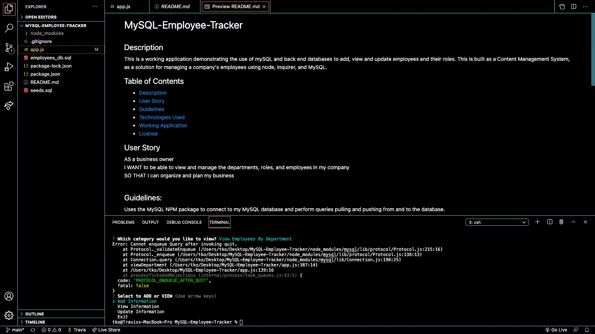

# MySQL-Employee-Tracker

## Description
This is a working application demonstrating the use of mySQL and back end databases to add, view and update employees and their roles. This is built as a Content Management System, as a solution for managing a company's employees using node, inquirer, and MySQL.

## Table of Contents

- [Description](#description)
- [User Story](#user-story)
- [Guidelines](#guidelines)
- [Technologies Used](#technologies-used)
- [Working Application](#working-application)
- [License](#license)
 

## User Story

AS a business owner
 
I WANT to be able to view and manage the departments, roles, and employees in my company
 
SO THAT I can organize and plan my business
 
 

## Guidelines:

Uses the MySQL NPM package to connect to my MySQL database and perform queries pulling and pushing from and to the database.
 
Uses InquirerJs NPM package to interact with the user via the command-line.
 

Uses console.table to print MySQL rows to the console.

## Technologies Used

- MySQL
- node.js
- command line applications
- Arrow Functions
- Back End Server functions
- NPM packages
- InquirerJs
 
 

## Working Application
Here is a demonstrated video of the application:

 
Demonstrated GIF:

## License
 
This is licensed under MIT.
 
© 2021 Travis Ko Coding